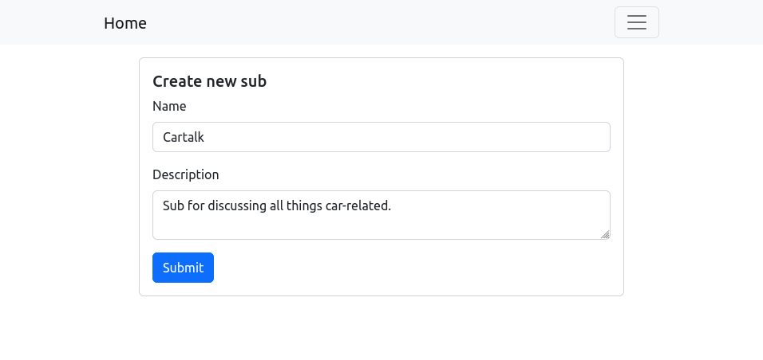
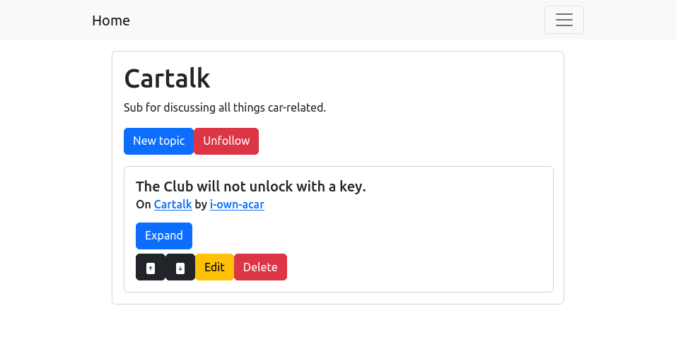
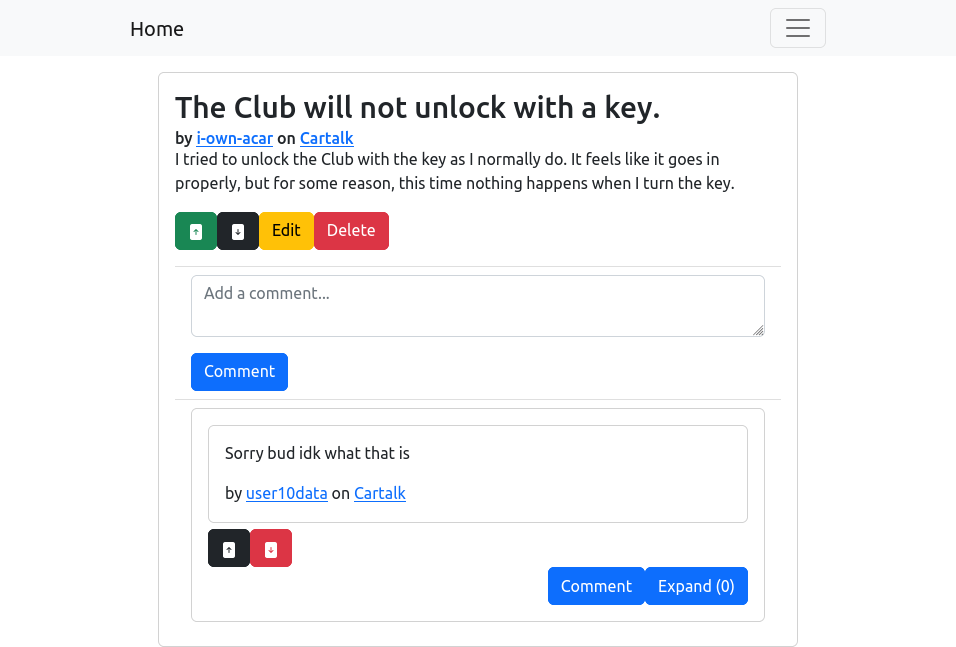

# Reddit Copy Front-end
## Front-end for the [API](https://github.com/jno3/reddit-copy-api)
### Description
This is a simple front-end application created with React to go together with the [back-end](https://github.com/jno3/reddit-copy-api) API previously developed.

Here are some screenshots of the project:

